<p align="center">
  
</p>

<p align="center">
  
</p>

<p align="center">
  <a href="https://instagram.com/ErshadZolfi"></a>
  &nbsp;
  <a href="mailto:ershad.zolfi@gmail.com"></a>
  &nbsp;
  
</p>


## 🩺 `$ whoami`

```yaml
name: Ershad Zolfi (DoctorGuidance)
class: Multi-Passionate Creator
alignment: Medicine × Technology × Art
current_quest: Understanding the human body, one system at a time
side_quests: [Telegram bots, AI experiments, business ventures, design]
recharge_ritual: [gaming 🎮, movies 🎬, declamation 🎙️, clouds ☁️, cats 🐈, cosmos 🌌]
rare_trait: Introverted, meticulous Beholder 👁️
```

I live at the intersection where a **stethoscope meets a terminal** — studying medicine by day, shipping code and ideas by night, and finding beauty in both.

<p align="center">
  
</p>


## 📡 Live Vitals

<p align="center">
  
</p>


## ⚡ Tech Arsenal

### Languages & Frameworks

<p align="center">
  
</p>

### Infra, Data & AI

<p align="center">
  
</p>

### Design & Creative

<p align="center">
  
</p>


## 📊 Lab Results

<p align="center">
  
</p>

## 🫀 Contribution ECG

<p align="center">
  
</p>


<p align="center">
  <sub>🩺 <b>Rx:</b> One meaningful commit daily. Take with curiosity. Refills: unlimited.</sub>
</p>

<p align="center">
  <b><code>while (alive) { learn(); build(); heal(); }</code></b>
</p>
