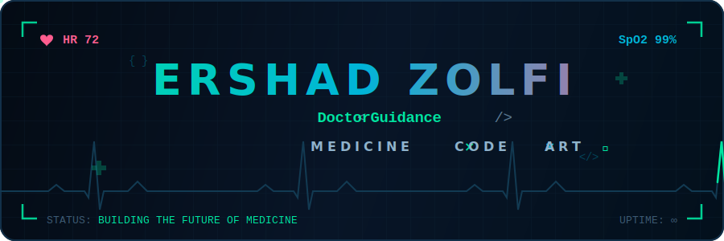
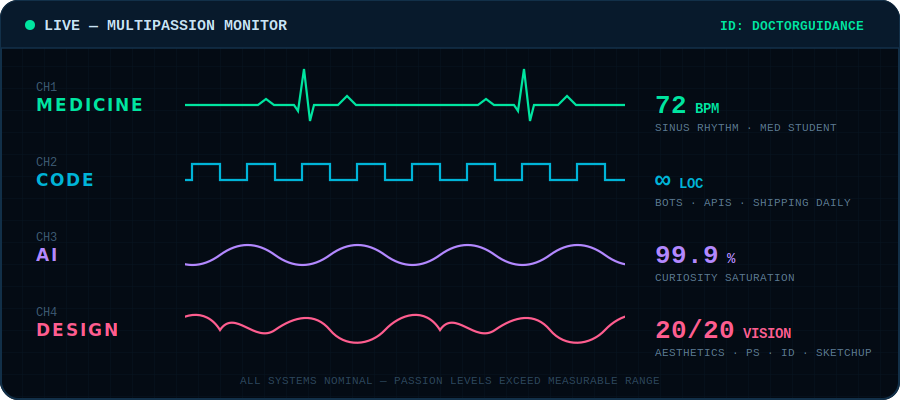

<div align="center">




<br/>

<a href="https://instagram.com/ErshadZolfi"></a>
&nbsp;
<a href="mailto:ershad.zolfi@gmail.com"></a>
&nbsp;


</div>


## 🩺 `$ whoami`

```yaml
name: Ershad Zolfi (DoctorGuidance)
class: Multi-Passionate Creator
alignment: Medicine × Technology × Art
current_quest: Understanding the human body, one system at a time
side_quests: [Telegram bots, AI experiments, business ventures, design]
recharge_ritual: [gaming 🎮, movies 🎬, declamation 🎙️, clouds ☁️, cats 🐈, cosmos 🌌]
rare_trait: Introverted, meticulous Beholder 👁️
```

I live at the intersection where a **stethoscope meets a terminal** — studying medicine by day, shipping code and ideas by night, and finding beauty in both.

<div dir="rtl" align="right">

### 🇮🇷 درباره من

خالقی چندعلاقه‌ای هستم؛ جایی زندگی می‌کنم که **پزشکی، تکنولوژی و هنر** به هم می‌رسند. روزها آناتومی و فیزیولوژی، شب‌ها کد و ایده. دانشجوی پزشکی‌ام، ربات‌های تلگرامی می‌سازم، طراحی می‌کنم، به هوش مصنوعی و آینده‌اش فکر می‌کنم و کارآفرینی را زندگی می‌کنم. وقت آزادم؟ بازی، فیلم، دکلمه، آسمان، ابرها، گربه‌ها و کیهان. ✨

</div>


## 📡 Live Vitals

<div align="center">

</div>


## ⚡ Tech Arsenal

<div align="center">

### Languages & Frameworks


### Infra, Data & AI


### Design & Creative


</div>


## 📊 Lab Results

<div align="center">


<br/><br/>


<br/><br/>


</div>

## 🐍 Contribution Snake

<div align="center">
<picture>
  <source media="(prefers-color-scheme: dark)" srcset="https://raw.githubusercontent.com/DoctorGuidance/DoctorGuidance/output/snake-dark.svg"/>
  <source media="(prefers-color-scheme: light)" srcset="https://raw.githubusercontent.com/DoctorGuidance/DoctorGuidance/output/snake.svg"/>
  
</picture>
</div>


<div align="center">

### 💊 Prescription of the Day


<br/>

<sub>🩺 <b>Rx:</b> One meaningful commit daily. Take with curiosity. Refills: unlimited.</sub>

<br/><br/>

**`while (alive) { learn(); build(); heal(); }`**

</div>
